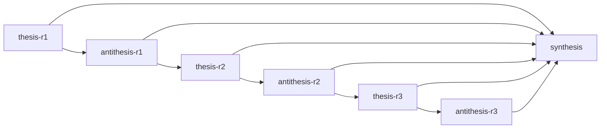

# Final Synthesis: Audit thesis_writing_plan for SNU ECE thesis format and strict low-level-planner-only rewrite v2

## 핵심 합의 지점

3라운드에 걸친 논쟁 끝에 양측은 `01_thesis_writing_plan.md`가 "원문을 다시 펴보지 않고 학사 논문을 끝까지 쓸 수 있는 수준"에 도달하기 위해 다음 5개 항목을 amendment list에 포함해야 한다는 데 실질적으로 합의했다. 다만 각 항목의 **결함 등급(심각도)**에 대해서는 끝까지 의견이 갈렸다.

1. **SNU 형식 요구사항 보강** — 표지·인준지·국문초록·키워드 개수·목차/표목차/그림목차·페이지 번호 체계(로마자/아라비아)·줄 간격·참고문헌 서식을 amendment list에 명시. Thesis는 이를 "반박 불가능한 결함"으로, Antithesis는 "`thesis_guideline.doc`와 줄 단위 대조로 즉시 검증 가능한 폐쇄형(closed-form) 한 줄 보강"으로 분류했으나, **항목을 추가해야 한다는 결론 자체는 일치**했다.

2. **§4.2.2 (Node Evaluation, line 196) 신규 발견** — "Once the route-level orchestrator chooses an ordered source/counterpart pair $(i,j)$..." 문장이 계획서에서 전혀 처리되지 않은 채 남아 있었다는 사실은 Antithesis가 직접 원문을 대조해 발견했고, Thesis도 즉시 수용했다. **이는 디베이트 전체에서 유일하게 양측이 처음부터 끝까지 이견 없이 합의한, 검증된 구체적 결함**이다 — "route-level orchestrator" 구절은 §4.2.3과 동일한 방식으로 삭제 지시를 추가해야 한다.

3. **Conclusion 종합 문장 처리** — 원문 결론 문장("이 결과들은 coupling이 최선이라는 핵심 주장을 뒷받침한다")을 단순히 "제외하라"고만 적어서는 안 되며, 그 자리를 채울 *instruction* — 최소한 "Q1–Q3의 개별 결과를 순차적으로 나열하고 결합 주장 없이 종결한다"는 문장 골격 또는 금지 규칙 — 을 명시해야 한다는 데 양측이 동의했다. (단, 이것이 "완성된 문장"인지 "instruction"인지의 경계 문제는 미해결 — 아래 참조.)

4. **Appendix(§822, Low-Level Planner State/Scoring/Meeting Details) 위임 관계 확인 문장** — 본론 §4.2.1·§4.2.3이 부록을 "exact"라는 단어로 참조하는 두 지점에서, "부록 디테일 없이 LOW 서술만으로 본문이 자기완결적으로 작성 가능하다"는 확인 문장을 amendment에 추가하는 데 양측이 합의했다.

5. **위험 용어 통합 표 + 절별 원문 대조 절차 확인** — brief가 명시한 8개 위험 용어(route, waypoint, anchor, orchestrator, online, pair-conditioned, Hamiltonian, mTSP)가 등장하는 모든 절과 처리 여부를 정리한 단일 표, 그리고 "각 절을 원문과 1회 대조했다"는 절차 확인 항목을 amendment에 포함하는 데 양측이 합의했다.

## 미해결 긴장

세 가지 지점에서 양측의 입장은 끝까지 수렴하지 않았으며, synthesis는 이를 명시적으로 남겨둔다.

- **"해결책의 일치"가 "진단(심각도)의 일치"를 함의하는가** — Thesis-r3는 antithesis가 구체적 amendment 형태(통합 표, 확인 문장, 문장 골격)에 동의한 것을 "결함이 실재했다는 자백"으로 해석했지만, Antithesis-r3는 "같은 처방에 동의하는 것과 같은 중증도로 진단하는 것은 별개"라며 이 추론을 명시적으로 반박했다(의사의 처방 비유). 이 메타 논쟁은 해소되지 않았다.
- **개방형 점검(위험 용어)이 디베이트 이전 계획서의 결함인가, 디베이트라는 검증 장치가 의도대로 작동한 결과인가** — Thesis는 §4.2.2 발견을 "계획서가 사전에 검증 절차를 갖추지 못했다는 증거"로 보았고, Antithesis는 "brief 출력 요구사항 7번이 위험 용어 점검을 애초에 디베이트의 산출물로 설계했으므로, 디베이트 중 발견은 설계 실패가 아니라 설계의 정상 작동"이라고 반박했다. 두 해석 모두 논리적으로 일관되며 brief 문언만으로는 완전히 판가름되지 않는다.
- **Conclusion 대체 표현의 카테고리 경계** — "Q1–Q3 순차 나열 + 결합 주장 금지"라는 문장 골격이 "instruction"인지 "draft 문장 자체"인지에 대해 양측은 끝내 합의하지 못했다(Thesis: 구조를 지정하므로 결함 해소; Antithesis: 빈칸이 남아 있으므로 instruction). 다만 실제로 amendment에 채택할 텍스트의 형태(골격 한 줄)에는 합의했으므로, 이 긴장은 실무적 결론을 바꾸지 않는다.

## 결론

`01_thesis_writing_plan.md`는 amendment list에 다음 5가지를 추가해야 작성자가 원문을 재참조하지 않고 학사 논문 전체를 안전하게 작성할 수 있는 수준에 도달한다:

1. SNU 형식 요구사항(표지/인준지/국문초록/목차/페이지 번호/줄 간격/참고문헌 서식) 체크리스트 — 저비용·즉시 검증 가능, 그러나 누락 시 형식 위반으로 직결되므로 amendment list에서 제외할 수 없음.
2. §4.2.2 line 196 "route-level orchestrator chooses..." 구절 삭제 지시 — 디베이트에서 검증된 유일한 구체적 결함으로 **최우선 처리**.
3. Conclusion 종합 문장에 대한 instruction("개별 결과 순차 나열 + 결합 주장 명시 금지")을 금지 규칙보다 한 단계 구체화된 문장 골격으로 추가.
4. §4.2.1·§4.2.3 본문-부록 위임 관계에 대한 자기완결성 확인 문장 추가.
5. brief의 8개 위험 용어 × 등장 절 통합 표, 그리고 절별 원문 대조를 최소 1회 수행했다는 절차 확인 항목 추가.

우선순위는 (2) > (5)·(3)·(4) > (1) 순으로 배분하는 것이 합리적이다 — (2)는 유일하게 검증된 실제 결함이고, (5)는 (2)와 같은 종류의 미발견 결함을 막는 구조적 안전장치이며, (1)은 검증 비용이 가장 낮고 발견되지 않아도 출판 전 최종 포맷팅 단계에서 거의 항상 교정 가능하다. 다만 등급의 절대적 크기(특히 "결함이냐 경미한 보강이냐")에 대한 양측의 근본적 견해차는 해소되지 않았으므로, 향후 유사한 audit에서는 "위험의 가역성"과 "디베이트 산출물 여부"라는 두 기준을 사전에 합의해 두는 것이 더 효율적인 논쟁을 가능케 할 것이다.

## Debate Graph

